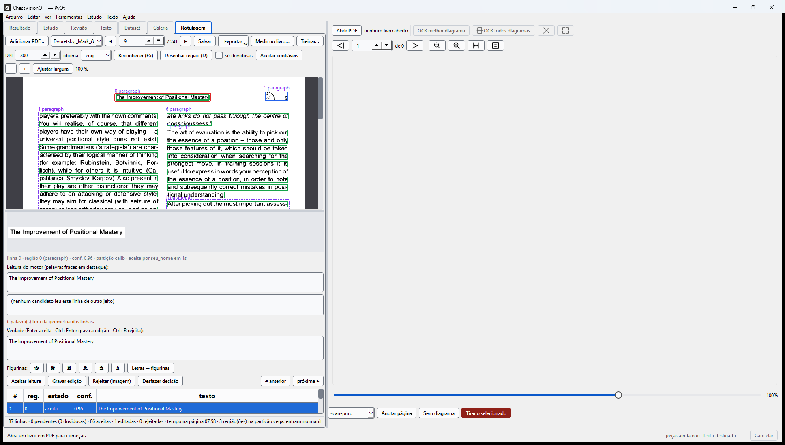

# Rotulagem humana e treino do Tesseract

> **Data:** 2026-09-13, modelo por livro em 2026-09-14 · Sol §SOL-0 (corpus), §SOL-11
> (revisão), §SOL-12 (hashes e versões).
> Ferramentas do pacote: a aba **Rotulagem** da janela do produto (`caissa.ui.views.rotulagem`,
> PyQt6, montada pelo tronco em `qt/painel_de_rotulagem.py` — está no `Caissa.exe`),
> `caissa-rotular` (a mesma bancada em Tk, `caissa.ocr.labeling.app`) e `caissa-treinar`
> (terminal, `caissa.ocr.training.cli`); `tools/rotular.py` e `tools/treinar_tesseract.py` são
> atalhos para rodar sem instalar. Pacotes `caissa.ocr.labeling` e `caissa.ocr.training`. O ciclo
> por livro — abrir um PDF, rotular, treinar, importar melhor — está no §7; a aba, no §7e.

`SOL_REPORT.md` §2 diz o que falta ao corpus dourado: **verdade escrita por gente sobre
scans reais**. Os portões de CER e de lances hoje medem tipografia sintética e regiões
nativas. Este documento descreve a bancada que fecha essa lacuna — o equivalente, no
projeto, ao modo *verificação* e ao *treino de padrões* do ABBYY FineReader — e o que
sai dela.

---

## 1. O que a bancada faz

```
uv run --no-sync caissa-rotular labeling --pdf "C:\...\PDF\Koblenz - El dominio del arte de la combinacion (1978).pdf" --reviewer ana
python tools/rotular.py labeling --pdf … --reviewer ana      # sem instalar o pacote
```

O `--no-sync` é obrigatório neste checkout: o `.venv` tem o PyTorch cu128 instalado por
fora do `pyproject` (ADR-0003), e um `uv run` sem ele sincroniza o ambiente com o `uv.lock`
e **desinstala** o torch, o torchvision, o ruff e o pytest. O pacote está instalado em modo
editável (`pip install -e .`), então cada mudança em `src/caissa` já vale na próxima
execução; só uma mudança nos entry points do `pyproject` exige reinstalar.

| Tela | O que é |
|---|---|
| esquerda | a página, com as regiões que o layout achou (tracejado roxo) e, dentro delas, uma caixa por **linha**, colorida pelo estado: âmbar pendente, verde aceita, azul editada, cinza rejeitada |
| direita, alto | o **recorte** da linha atual a 300 DPI |
| direita, meio | a **leitura do motor** com palavras fracas em destaque (amarelo abaixo do limiar, vermelho bem abaixo), as **leituras alternativas** dos outros candidatos (variante × motor), o **motivo** da dúvida e o campo **Verdade** |
| direita, baixo | a lista de linhas da página; «só duvidosas» filtra o que merece olhar |

O reconhecimento é o do produto (`OcrService.recognize_image`): mesmo layout, mesmos
candidatos, mesma fusão. Uma região `page` (layout não segmentou) é partida nos parágrafos
que o próprio motor devolve. Se o layout errou, **D** desenha uma região à mão e ela é
reconhecida sozinha.

**Teclas:** `Enter` aceita a leitura (ou grava o que você digitou, se mudou) e vai à
próxima pendente · `Ctrl+Enter` grava a edição · `Ctrl+R` rejeita (não é texto: mancha,
diagrama, coordenada) · `Alt+1`/`Alt+2` copiam uma alternativa · `Ctrl+↑/↓` navegam ·
`F5` reconhece a página · `PageUp/PageDown` mudam de página · `Ctrl+S` salva.
«Aceitar confiáveis da página» aceita de uma vez toda linha sem palavra fraca, sem candidato
discordante e com texto — o «pule o que o motor tem certeza» do FineReader; as duvidosas
continuam pendentes.

Botão direito numa região: tipo (`paragraph`, `movetext`, `heading`, …), **FEN inicial dos
lances** (o que o replay de legalidade precisa e 98 % do corpus não tem — `SOL_REPORT.md`
§3), rejeitar a região inteira, remover.

Cada decisão grava **quem, quando e quantos segundos** (`audit.jsonl`); o tempo por página
fica em `pages/*.json`. Projeto = pasta com `project.json`, `pages/`, `audit.jsonl`.

---

## 2. A regra da partição cega

Cada região completa vira um item do manifesto com id
`real:<livro[:24]>:<página>:<y0>:<x0>` (o esquema de `build_manifest.py`, mais `x0` para
duas colunas). A partição é a função fixa do id (`partition_for`): 50 % dev, 25 % calib,
25 % cega. A janela mostra a partição da região atual e a barra de estado conta as regiões
cegas da página.

**Uma região cega entra no manifesto (oculta por padrão) e em mais nada**: não vai para
a verdade de treino, nem para as correções, nem para os pares de calibração. A regra é por
região, e não por página, porque a partição do manifesto é por item e um item é uma região
— uma página com vinte regiões seria cega com probabilidade 1 − 0,75²⁰ ≈ 99,7 %.

`caissa.ocr.review.blind_guard`, que protege a fila de revisão do importador, é mais
conservador (marca a página inteira). Os dois concordam sobre quais ids são cegos.

---

## 3. O que sai (menu *Exportar*)

| Saída | Onde | Consumidor |
|---|---|---|
| **Verdade para treino** | `<projeto>/ground_truth/` — `<nome>.png` + `<nome>.gt.txt` por linha, `index.jsonl` com documento, página, região, partição, `report.json` | `lstmtraining` (via `caissa.ocr.training`) |
| **Fundir no manifesto dourado** | `benchmarks/corpus/golden/manifest.private.json` (ou outro) — um item `pdf-scan` por região completa, `strata=("native",)`, tags `human-labelled`, `scan`; itens com o mesmo id são substituídos | `bench_sol.py`, `calibrate_sol.py`, `sol_gate.py` |
| **Correções e pares** | `<projeto>/corrections.json` (o formato de `ReviewQueue.corrections()`), `<projeto>/calibration_pairs.json` (`(confiança, correta)` por linha, com motor/idioma/DPI/tipo) | auditoria; calibração direta |

«Região completa» = todas as linhas decididas e ao menos uma mantida como texto. O
gênero (`movetext` a partir de 6 lances) e o script (`cyrillic` para `ru`) seguem
`build_manifest.py`. Para o benchmark achar o PDF, ele precisa estar em `PDF_DIR`
(`sol_corpus.py`); o projeto guarda o caminho absoluto para as outras exportações.

Depois de fundir, o hash do corpus muda: o baseline precisa ser recongelado
(`bench_sol.py --system baseline --publish`) antes de o portão comparar alguma coisa.
A faceta `source` do relatório separa `pdf-scan` de `pdf-native` e `synth`.

---

## 4. Treino (ajuste fino do Tesseract)

O FineReader treina *padrões* por caractere. O reconhecedor do Tesseract 5 é uma LSTM
por linha e não tem padrões; o equivalente é o **ajuste fino**: o modelo base continua
treinando sobre linhas com verdade até o erro num conjunto reservado parar de cair, e o
resultado é um `.traineddata` novo que o motor carrega como qualquer idioma.

```
python tools/treinar_tesseract.py --project labeling --base-lang spa --preflight
python tools/treinar_tesseract.py --project labeling --base-lang spa --download-base
python tools/treinar_tesseract.py --gt labeling/ground_truth --base-lang spa --base-model models/tessdata_best/spa.traineddata --iterations 3000
```

Ou o botão **Treinar…** da janela (mesmo pipeline, log ao vivo, cancelável).

Passos (`caissa.ocr.training.tesseract_finetune`), cada um nomeado no log:

1. copia a base para `work/` e desempacota (`combine_tessdata -u`) — `.lstm` para continuar
   e `.lstm-unicharset` com os caracteres que o modelo sabe emitir; copia `configs/`
   também, porque `--tessdata-dir` decide onde `lstm.train` é procurado;
2. confere cada linha contra o unicharset; um caractere que a base não codifica (`♖`,
   por exemplo) **estende o alfabeto** — ver §4c; com `--no-extend-charset` a linha é
   excluída e listada;
3. gera um `.lstmf` por linha (`tesseract <png> <base> --psm 13 lstm.train`), com o `.box`
   `WordStr` ao lado da imagem — é de lá que o Tesseract lê a verdade;
4. divide pela partição do `index.jsonl`: **dev treina, calib avalia** (sem calib, um
   décimo de dev por hash); cega nunca chegou aqui;
5. `lstmtraining --continue_from` com progresso (iteração, erro de treino);
6. `lstmtraining --stop_training` sela o checkpoint num `.traineddata`;
7. `lstmeval` na lista de avaliação, base e modelo novo — **CER e WER antes/depois**;
8. copia os idiomas instalados para a pasta de saída, que fica utilizável como
   `--tessdata-dir` sozinha; grava `weights.json` (hash, licença, base), `report.json`,
   `report.md`, `log.txt`.

### A base precisa ser float

O instalador do Windows traz os modelos **inteiros** (`tessdata_fast`): reconhecem mais
rápido e **não aceitam ajuste fino** — o `lstmtraining` responde
`is an integer (fast) model, cannot continue training` e o pipeline para com essa frase
traduzida. O preflight avisa antes (tamanho do `.lstm`). É preciso o modelo float de
`tessdata_best` (Apache-2.0): `--download-base` ou o botão «Baixar base» o buscam de
`github.com/tesseract-ocr/tessdata_best` para `models/tessdata_best/`, com hash gravado.

### 4c. Rota B — o Tesseract aprende as figurinas

O caminho «FineReader» de verdade: o modelo passa a **emitir** ♔♕♖♗♘♙. Para isso a verdade
precisa contê-los — a janela tem a **paleta de figurinas** (botões e `Alt+K/Q/R/B/N/P` no
campo Verdade) e o botão **Letras → figurinas**, que converte `Nf3`→`♘f3`, `22...Bf8`→`22...♗f8`
nos tokens de lance do campo (peão, palavra e maiúscula solta ficam como estão; Ctrl+Z desfaz).
Com o leitor de glifos ligado (§4b) a hipótese já costuma vir com as figurinas; basta aceitar.

No treinador (`extend_charset=True`, padrão; caixa «estender alfabeto» no diálogo), um
caractere fora do unicharset da base dispara o que o tesstrain faz para acrescentar
caracteres a um modelo:

1. `unicharset_extractor --norm_mode 2` sobre a verdade → `gt.unicharset`;
2. `merge_unicharsets base.lstm-unicharset gt.unicharset merged.unicharset`;
3. `combine_lang_model` → `.traineddata` inicial com o alfabeto novo (listas de palavras,
   números e pontuação tiradas da própria verdade; o `radical-stroke.txt` que ele exige mesmo
   para latim é uma tabela vazia — nada é baixado);
4. `lstmtraining --continue_from base.lstm --old_traineddata base.traineddata
   --traineddata inicial.traineddata`: a camada de saída é remapeada para o alfabeto novo
   (`Code range changed from 119 to 124`), o resto dos pesos continua.

Os `.lstmf` não dependem do alfabeto (guardam o texto; a codificação acontece no treino),
então são gerados uma vez só. O `lstmeval` da **base** pula as linhas que ela não codifica
(`Encoding of string failed`) — o CER «antes» é do subconjunto sem figurinas; o «depois» é de
todas. O relatório diz o tamanho do alfabeto e quais caracteres entraram.

**Medido em 2026-09-13** com 724 linhas rotuladas à mão (11 páginas: Dvoretsky & Yusupov
p9–p18, figurinas; Modern Endgame Manual p5), base `models/tessdata_best/por.traineddata`
(float), 566 linhas fora da partição cega → 367 treino, 199 avaliação (72 com figurinas,
136 figurinas). Avaliação por linha, `tesseract --psm 7`, CER por Levenshtein:

| avaliação (199 linhas) | base `por` | lr 1e-4, 3 000 it | **lr 1e-3, 12 000 it** |
|---|---:|---:|---:|
| prosa (127 linhas), CER | 0,6 % | 0,3 % | 0,4 % |
| linhas com figurinas (72), CER | 10,2 % | 8,3 % | **2,0 %** |
| figurinas emitidas certas (de 136) | 0 | 0 | **122 (90 %)** |
| por peça | — | — | ♕ 30/30 · ♖ 42/42 · ♘ 40/40 · ♗ 10/11 · **♔ 0/13** |

Duas lições que viraram padrão: (1) a taxa de aprendizado do tesstrain para ajuste fino
(1e-4) **não ativa classes novas** — com ela o modelo aprendeu a prosa e continuou mudo nas
figurinas; 1e-3 é o padrão agora; (2) uma peça com poucas amostras não entra: o ♔ teve 29
linhas no treino e saiu 0/13 (vira ♗ ou nada). O `lstmeval` do relatório (4,5 %) é sobre
todas as linhas, inclusive as que a base não codifica, por isso é maior que o CER da tabela.
O modelo está em `models/tessdata/caissa_por.traineddata` (registro em `weights.json`) e é
o que `bench_sol.py --tessdata-dir models/tessdata --model-prefix caissa` mede.

### Medir o modelo treinado

```
python benchmarks/bench_sol.py --tessdata-dir models/tessdata --model-prefix caissa --label caissa_spa
```

`por` vira `caissa_por` quando `models/tessdata/caissa_por.traineddata` existe; o resto
usa a base copiada. O relatório registra `tessdata_dir` e `model_prefix` no ambiente.
O portão (`sol_gate.py`) compara com o baseline como qualquer outra mudança.

**Medido em 2026-09-13** (corpus com 256 `pdf-scan`, 738 linhas por rodada, mesmo hash), sem
modelo → com `caissa_por` (aplicado a todo item `por`/`por+eng`):

| | sem | com `caissa_por` |
|---|---:|---:|
| scans rotulados (155 itens `pt`): lances certos | 222 / 425 (52 %) | **398 / 425 (94 %)** |
| scans: lances inventados · abstenções | 25 · 59 | **11 · 45** |
| scans: CER ponderado nos itens que ambos leram (127) | 1,21 % | **1,02 %** |
| `synth` (prosa portuguesa tipografada, 382): CER | 5,7 % | 6,4 % |
| `pdf-native` (152): CER | 1,06 % | 1,47 % |

Duas leituras. (1) Onde foi treinado, o modelo entrega o que prometia: as figurinas viram
lances e as abstenções caem. A média de CER por item nos scans *sobe* (3,1 → 3,4 %) porque
19 regiões curtas que a base abstinha passaram a ser respondidas com erro (CER médio 18 %
nelas) — abstenção conta zero na média, resposta errada conta. (2) **Fora dos scans o
modelo regrediu**: 367 linhas inglesas em cima do `por` desaprenderam um pouco de português
(`synth` e `pdf-native` pioram), e o starter do `combine_lang_model` não carrega os
dicionários da base. Consequência prática: um modelo ajustado é **por livro/idioma**, não um
substituto global do `por` — treinar o Dvoretsky a partir do `eng` (`--base-lang eng
--download-base`) e rotular as páginas com o idioma certo (`eng`, não `por+eng`: 155 dos
199 itens de scan estão com `prose_lang=pt` por causa do padrão da janela) é o próximo passo.
Três defeitos achados por esta medição e corrigidos: `--tessdata-dir` relativo quebrava no
diretório temporário do motor; a pasta do modelo precisa de `configs/` (o treinador copia);
e um motor "disponível" que falha em toda região abstinha em silêncio — agora se declara
indisponível com a frase que diz o que copiar.

**`caissa_eng` (2026-09-13, noite)** — mesma receita a partir do `eng` float
(tessdata_best), 744 linhas (482 treino, 262 avaliação; ♘×110 ♖×109 ♕×68 ♗×66 ♔×40), páginas
re-marcadas como `eng`; aplicado só aos itens `en`, o `por` intocado. Sem → com, mesmo corpus
(hash `43ac7c57017324d8`):

| grupo | lances | inventados | abstenções | CER pond. |
|---|---:|---:|---:|---:|
| `pdf-scan/en` (199, o livro treinado) | 291 → **550** / 586 | 37 → **23** | 67 → **45** | 1,14 → 2,09 % |
| `pdf-native/en` (28) | 82 → 85 / 96 | 4 → 7 | 0 | 1,87 → **1,24 %** |
| `synth/en/fax_dither` (24) | 224 → 264 / 490 | 46 → **165** | 0 | 8,1 → 8,5 % |
| `synth/en/scan_clean_300` (39) | 986 → 968 / 1045 | 20 → 47 | 0 | 5,0 → 5,9 % |
| controle `photo` (ruído sem texto) | — | — | — | **produziu `♖ … ♘♔R♗!`** |

O modelo aprendeu as figurinas do livro (94 % dos lances) e **aprendeu também a ver figurinas
no ruído**: inventa lances em páginas tipografadas degradadas e falha o controle negativo
(portão SOL-2). Não é um `eng` melhor; é um leitor do Dvoretsky. A saída escolhida foi (a): **o modelo é candidato secundário da fusão** (`figurine_candidates`,
padrão ligado; pasta `models/tessdata` ou `$CAISSA_FIGURINE_TESSDATA`; só o idioma do livro
que tem `caissa_<lang>`), com três guardas descobertas medindo: a figurina dele não substitui
uma **letra de peça impressa** do idioma (`Nf3` fica `Nf3`; o leitor de glifos, que lê letras
como letras, não é barrado); nenhum dos dois leitores entra em **página cirílica**; e a fusão
ganhou duas correções gerais que os candidatos novos expuseram — lance com número colado ou
marca de avaliação (`8.Kc2!`, `Bg6—+`) conta como apoiado, e a leitura escolhida herda o
prefixo numérico do âncora (`2.25` + `2g5` → `2.g5`).

**Caminho de produto medido em 2026-09-14** (Tesseract âncora + leitor de glifos + `caissa_eng`
secundário), sem → com, mesmo corpus (hash `43ac7c57017324d8`, 747 linhas):

| | lances certos | inventados | abstenções | CER pond. |
|---|---:|---:|---:|---:|
| `pdf-scan` (199, os livros rotulados) | 130 → **395** / 460 | 159 → **34** | 57 → 55 | 2,34 → **1,08 %** |
| `pdf-native` (152) | 751 → 754 / 792 | 12 → 14 | 0 | 1,21 → 1,22 % |
| `synth` (387) | 4 437 → **4 629** / 5 782 | 241 → 269 | 5 → 5 | 5,90 → 5,81 % |
| **geral** | 75,7 → **82,1 %** | 412 → **317** | 62 → 60 | CER média 4,61 → **4,01 %** |

Controles negativos: 0 → 0. Custo: 1,99 → 2,37 s/Mpx. O único número que piora são +28
inventados no `synth`, concentrados nos estratos mais ruidosos (`fax_dither` +15, `photo` +6):
tokens ilegíveis do âncora trocados por lances plausíveis de outro candidato — a regra geral
da fusão, não as figurinas. Os quatro portões absolutos continuam vermelhos (as metas de Sol são
0,5 % / 2 % / 99,8 % / 0); o que mudou é a direção.

---

## 4b. Figurinas: o leitor de glifos como segunda opinião

Nenhum motor de linha lê figurina: o `eng.traineddata` não tem ♖ no alfabeto, e o Tesseract
devolve a forma latina mais parecida — sempre a mesma (♖→H, ♕→W, ♘→S, ♗→2/8/&). O tronco
ChessVisionOFF tem um **classificador de glifos** treinado nessas formas
(`models/char_classifier.pt`, 314 classes com ♔♕♖♗♘♙ e ligaduras como `♕x`; 99,1 % no teste).
`caissa/ocr/engines/glyph.py` o expõe como motor, e o `OcrService` o consulta como
**candidato secundário** em regiões que carregam notação (`glyph_candidates=True`, padrão):

- roda **uma faixa por linha** que o Tesseract achou, para nunca fundir duas colunas;
- na fusão SOL-6 ele **nunca ancora** e nunca decide pontuação ou caixa (`36...` continua `36...`);
- a única troca que faz sozinho é a **figurina no lugar do sósia latino** — mesmo lance
  depois do primeiro caractere (um dígito/letra trocado tolerado), lance válido, confiança
  ≥ 0,70: `Hea!`→`♖e8!`, `2d5`→`♗d5`, `22...28,`→`22...♗f8,`, `De2`→`♘e2`; um lance de peão
  (`e4`) nunca é tratado como cifra;
- a prosa fica com o Tesseract (`If`, `40`, `Hubner:` — o leitor de glifos lê `lf`, `4o`).

Medido na página 10 de *Dvoretsky & Yusupov, Secrets of Positional Play* (figurinas, inglês):
das 27 linhas de lances, todas as figurinas saem certas depois da fusão; sem o candidato,
nenhuma. Custo: ~2 s a mais por página na GPU. Sem o tronco na máquina, o motor se declara
indisponível com uma frase e nada muda.

Isso **não treina** nada: o rótulo humano continua sendo a verdade, mas a hipótese que o
revisor vê já vem com ♖e8!, e é isso que entra no `.gt.txt` quando ele aceita — o que, por
sua vez, alimenta a rota B (§4c).

## 5. O que foi verificado em 2026-09-13

- Três páginas de *Koblenz — El dominio del arte de la combinación (1978)* (scan, espanhol):
  reconhecimento em 3,4 s/página, 19 regiões por página após a partição por parágrafo,
  linhas com confiança e alternativas; 47 linhas exportadas, **47 `.lstmf` gerados** com
  as ferramentas instaladas (Tesseract 5.5.0); `lstmtraining` recusou o `spa.traineddata`
  instalado com a mensagem de modelo inteiro, capturada como falha explícita.
- **O ajuste fino em si não foi executado**: exige o modelo float, que não está nesta
  máquina. O pipeline a partir do `lstmtraining` está coberto por `tests/unit/ocr/test_training.py`
  com um executor falso (ordem das ferramentas, listas por partição, unicharset, relatório,
  registro de pesos, recusa do modelo inteiro).
- 16 testes novos (`test_labeling.py`, `test_training.py`) mais 8 do leitor de glifos
  (`test_glyph_engine.py`); `tests/unit/ocr` + `tests/unit/ingest`: 686 passam.

## 6. O que continua faltando

1. Rotular de verdade: ≥ 20 páginas para a revisão cega de `SOL_REPORT.md` §5, 200 para a
   meta de Sol — trabalho humano, com a bancada pronta.
2. ~~Baixar um `tessdata_best` e rodar o primeiro ajuste fino de ponta a ponta~~ — feito
   (§4c); o que falta é o modelo aprender a *não* emitir figurina no ruído (amostras
   negativas no treino).
3. A janela de revisão do shell F9 continua pendente: esta é uma bancada Tk de rotulagem,
   não a interface do produto.

---

## 7. Modelo por livro — o ciclo do FineReader dentro do caissa

> 2026-09-14. `caissa.ocr.training.books`, `caissa.ocr.labeling.measure`, botões
> **Treinar…** (com «modelo deste livro») e **Medir no livro…** da janela,
> `caissa-treinar --document … --book`, `PdfImportOptions.book_models`.

O §4c mediu o que o treino de padrões do FineReader já sabe: **o modelo é do livro**.
O `caissa_eng` treinado no Dvoretsky lê 94 % dos lances do Dvoretsky e inventa figurinas
no ruído de qualquer outro scan. Um modelo global «melhor que o `eng`» não sai de 700
linhas; um leitor de *um* livro sai. Então o ciclo do produto é por PDF:

```
abrir o PDF na janela ──► rotular algumas páginas ──► Treinar… (modelo deste livro)
        ▲                                                         │
        │                                                         ▼
importar o PDF com o modelo ◄── livros.json registra: hash do PDF → pasta do modelo
        │
        ▼
Medir no livro…: as páginas rotuladas relidas sem e com o modelo, por partição
```

### 7a. O registro

`models/tessdata/livros.json` liga o **hash de conteúdo** do PDF (o mesmo SHA-256 de
`PdfDocument.content_hash`) ao diretório do modelo: `models/tessdata/livros/<livro>/`,
que o treinador deixa utilizável sozinho como `--tessdata-dir` (modelo novo, idiomas base
copiados, `configs/`, `weights.json`, `report.md`, `log.txt`). Hash, e não caminho: uma
cópia do livro com outro nome acha o modelo; outro livro com o mesmo nome de arquivo não.
Um modelo cujo arquivo sumiu deixa de ser oferecido (`BookModel.available`).

O registro entra por dois caminhos, com o mesmo resultado:

| onde | como |
|---|---|
| janela | **Treinar…** com «modelo deste livro» (ligado por padrão quando há um PDF aberto): só as linhas do livro treinam (`FineTuneConfig.documents`), a pasta de saída é a do livro, a base sugerida é o idioma do livro (`eng` para um livro `eng`) e o float já baixado em `models/tessdata_best/`; ao terminar, registra e a janela passa a reconhecer com o modelo (F5) |
| terminal | `caissa-treinar --project labeling --document "<livro>" --book --base-lang eng --base-model models/tessdata_best/eng.traineddata --iterations 12000` |

### 7b. A importação usa o modelo — só nesse livro

`PdfImporter` consulta o registro **antes** de construir o `OcrService` (só quando alguma
página precisa de OCR; com o registro vazio, nada é lido nem hasheado). Com entrada, o
serviço nasce com `figurine_tessdata` apontando para a pasta do livro e o relatório da
importação ganha a nota `modelo ajustado para este livro: caissa_eng · treinado em … · N
linhas de treino · CER avaliação a → b %`. O papel do modelo não muda: **candidato
secundário** nas regiões com notação (§4c), a fusão toma dele a troca sósia→figurina e
nunca o deixa ancorar — as invenções que ele faz sozinho não têm por onde entrar.
`PdfImportOptions(book_models=False)` desliga.

Um PDF sem entrada continua como antes: o `OcrService` procura `caissa_<idioma>` em
`models/tessdata/` (ou `$CAISSA_FIGURINE_TESSDATA`). Esse é o `caissa_eng` global do §4c,
aplicado a todo livro `eng` — a medição do caminho de produto com ele (sem → com, mesmo
corpus) é da sessão que o treinou; o §7 não muda esse comportamento, só permite que um
livro tenha o seu.

### 7c. Medir no livro

**Medir no livro…** relê cada página rotulada do livro duas vezes com o serviço do produto
(`OcrServiceConfig` sem candidato ajustado e com a pasta do livro), casa cada linha
rotulada (aceita ou editada, fora da partição cega) com a faixa reconhecida por
sobreposição (IoU ≥ 0,5) e pontua com as métricas do benchmark (`caissa.ocr.metrics`):
CER ponderado por comprimento, linhas exatas, lances certos e inventados, figurinas
emitidas. Duas regras: as linhas ficam **por partição** — `dev` treinou o modelo e o
lisonjeia, `calib` ficou de fora e é o número a citar — e uma linha que a releitura não
achou conta como **não lida** (custa todos os seus caracteres), não como certa. Sai em
`<projeto>/medidas/<livro>.md` e `.json`.

**Medido em 2026-09-14** — ciclo completo pelo caminho novo, no Dvoretsky SFC4 (scan, `eng`):
`caissa-treinar --document … --book --base-lang eng --base-model models/tessdata_best/eng.traineddata
--iterations 12000`: 719 linhas do livro (458 treino, 261 avaliação; 197 cegas retidas), 963 s,
alfabeto 109 → 115 (♘×110 ♖×109 ♕×68 ♗×66 ♔×40 –×1), `lstmeval` na avaliação CER 2,14 → 1,36 %,
WER 5,97 → 2,94 %. Registrado em `livros.json` (hash `698e2153…`, pasta
`livros/dvoretsky_mark_yusupov_artur_sfc4_secret/`). Depois, **Medir no livro** (13 páginas,
97 s; «sem modelo» = serviço do produto com o leitor de glifos ligado e sem modelo ajustado):

| linhas | métrica | sem modelo | com modelo do livro |
|---|---|---:|---:|
| avaliação (`calib`, fora do treino) (261) | CER ponderado | 0,6 % | 0,6 % |
|  | linhas exatas | 235 / 261 | **238 / 261** |
|  | lances certos | 264 / 288 | **271 / 288** |
|  | lances inventados | 12 | **10** |
|  | figurinas certas | 184 / 204 | **191 / 204** |
| treino (`dev`) (458) | CER ponderado | 0,6 % | 0,4 % |
|  | lances certos | 338 / 365 | 349 / 365 |
|  | lances inventados | 16 | 10 |
|  | figurinas certas | 243 / 268 | 251 / 268 |
| todas (719) | não lidas | 0 | 0 |

Leitura: o ganho do modelo do livro **em cima do leitor de glifos** é pequeno e todo na
direção certa (nas linhas que ele não viu: +7 lances, −2 inventados, +7 figurinas, CER igual)
— o grosso das figurinas já vinha do leitor de glifos (§4b); o modelo fecha o que sobra e não
piora a prosa, que continua a do âncora. Sem o leitor de glifos (não medido aqui) a diferença
seria a do §4c.

Importação real da p21 do mesmo PDF com a camada de texto forçada à rejeição: nota
`modelo ajustado para este livro: caissa_eng · treinado em 2026-09-14 · 458 linhas de treino ·
CER avaliação 2.1 → 1.4 %`, `source=ocr`, lances certos no IR (`14 Bg5!!`, `18 Rhe1`; a camada
de notação canoniza figurina → letra). Com `book_models=False`, sem nota e sem o candidato.

**Ressalva que vale para este PDF:** o Dvoretsky tem uma camada de texto (OCR de origem) que o
veredito **mantém** a 0,55 apesar de 43 % dos lances mangled (`'i'd6+`, `l:th`) — nessas páginas
o importador não chama o OCR, e o modelo do livro só entra quando a camada é rejeitada ou não
existe. Fazer o OCR concorrer com a camada danificada (F5 §4.1 já baixa a confiança para isso)
é a próxima peça; não é deste §7.

### 7e. A aba Rotulagem da janela do produto (2026-09-14)

O mesmo ciclo dentro do `Caissa.exe`: `caissa.ui.views.rotulagem.PainelDeRotulagem` é a bancada
em PyQt6 — página com regiões e linhas coloridas pelo estado (cena em pontos da página, zoom
pela vista), recorte, leitura com palavras fracas, alternativas, verdade com paleta de figurinas,
região desenhada (D), tipo/FEN inicial/rejeitar/remover no botão direito, Exportar, **Treinar…**
(modelo deste livro, registrado) e **Medir no livro…**. Nada é decidido no widget: são os mesmos
módulos da bancada Tk, e o que as duas janelas partilham (`letters_to_figurines`, `fen_problem`,
cores por estado, o projeto padrão) mora em `caissa.ocr.labeling.helpers`.

O tronco a monta como **sétima aba** (`ChessVisionOFF_Puro/qt/painel_de_rotulagem.py`, `abas.ROTULAGEM`
no acervo): num checkout do tronco sem a suíte ao alcance (o `.venv` de lá é Python 3.10) a
janela sobe com as seis de antes e o motivo vai para o log; no bundle os dois pacotes moram no
mesmo arquivo e a aba existe sempre. No bundle o projeto de rotulagem fica em `rotulagem/` ao
lado do executável e os modelos em `models/tessdata/` (`livros/<livro>/`, `livros.json`) — as
pastas graváveis do `Caissa.exe`. O treino exige o Tesseract instalado na máquina
(`lstmtraining`, `combine_tessdata`…): o bundle não o leva, e o diálogo diz o que falta.

**Verificado no `Caissa.exe` (build de 2026-09-14, 296,4 MB, `packaging/bundle.json`):** a
sétima aba existe e abre o projeto de rotulagem do Dvoretsky com as 87 linhas da p9. A captura é
do buffer da própria janela (`PrintWindow`), como no `F12_REPORT.md` §5.2:



Para rodar o `.exe` sem baixar 2,6 GB: `CaissaPrimeiraExecucao.exe --de-pasta <tronco> --sem-torch`
instala os pesos, e a pasta `runtime/` recebe a mesma lista de pacotes do `torch_manifesto.json`
copiada do `.venv` (versões idênticas). O `Caissa.exe` sem torch **abre o assistente e começa o
download por conta própria** — vale saber antes de clicar.

Testes: `tests/unit/ui/test_rotulagem_view.py` (pulam sem PyQt6; rodam no `.venv-pack`) e, no
tronco, `test_qt_janela.test_as_seis_abas_estao_na_ordem_da_spec` (sete quando a suíte está ao
alcance) e a catraca de `qt/janela.py` (1883 → 1887, as quatro linhas da montagem).

### 7f. Exportar o livro para EPUB e DOCX — inteiro ou por intervalo de páginas (2026-09-14)

O fim do ciclo — rotular, treinar, **importar melhor** — sai da própria aba: o menu *Exportar*
ganhou **Livro para EPUB…** e **Livro para DOCX…**. O diálogo (`caissa.ui.views.exportacao`)
pergunta o formato, o alcance — *livro completo*, *intervalo de X até Y* (o *de* já vem com a
página na tela) ou uma *lista* como `1-3, 7, 40-` — e o destino, que por padrão nasce ao lado do
PDF com o mesmo nome e, quando é parcial, com as páginas no nome (`Livro (p. 10-25).epub`) para
duas exportações não se sobrescreverem. Uma caixa *OCR* desliga o reconhecimento das páginas sem
camada de texto (elas entram como imagem: o caminho rápido). A exportação roda numa thread,
o progresso e o fim vão para a linha de status da aba; só a falha abre caixa.

O que é regra mora em `caissa.export.book`, sem toolkit, e é o mesmo que a linha de comando usa:
`parse_page_range` (páginas contadas **de 1** no que a pessoa escreve, zero-based no que o
código passa ao importador), `default_output_path`, `export_book` — a composição
`caissa.ingest.pdf.import_pdf` (F2, com o modelo do livro do §7b quando há) → exportador de
`caissa.export`. Um livro parcial guarda no arquivo quais páginas é (`caissa:pages` nos
metadados e uma linha na descrição, «Páginas 10-25 de 402 do original»); o inteiro sai limpo.

```
caissa-exportar Livro.pdf --epub
caissa-exportar Livro.pdf --docx --paginas 10-25
caissa-exportar Livro.pdf --saida "Capítulo 3.epub" --paginas "40-, 7" --sem-ocr
```

Testes: `tests/unit/export/test_book.py` (intervalos, livro completo, faixa, cancelamento,
CLI; rodam no `.venv`) e `tests/unit/ui/test_exportacao_view.py` (o diálogo e o controlador;
pulam sem PyQt6 — `$env:PYTHONPATH = ".venv-pack\Lib\site-packages"` empresta o do bundle).
No tronco os mesmos dois itens estão em *Arquivo*, ao lado de *Exportar o livro para PGN…*
(commit `e98b738`: `exportar_epub`/`exportar_docx` no catálogo e no menu,
`qt/exportador_de_livro.py` monta o `ExportadorDeLivro` ligado ao rodapé e à tranca da
janela). Sem a suíte ao alcance — o `.venv` do tronco é Python 3.10 — os itens ficam cinza
com o motivo na dica (`menu.impedir`); no bundle existem sempre.
`test_qt_janela.test_exportar_epub_e_docx_so_prometem_o_que_a_suite_entrega` cobre os dois
caminhos (rodar com o Python da suíte e o PyQt6 do `.venv-pack` no `PYTHONPATH` para o
caminho com suíte).

### 7d. O que não é

- Não é o treino de *padrões* do FineReader (por caractere): é ajuste fino da LSTM de linha,
  com as regras do §4.
- Não é a janela de revisão do produto (SOL-11 continua atrelado ao shell F9): é a bancada
  Tk, agora dentro do pacote e com o registro que a importação lê.
- Não corrige o defeito medido no §4c (figurinas no ruído): o modelo continua sendo segunda
  opinião por isso mesmo. Amostras negativas no treino são o próximo passo.
